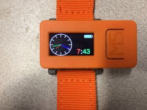

# barnabas_orange_watch
an inexpensive, maker-friendly wristwatch with WiFi, Bluetooth, and sensors



## Overview:
The company M5Stack has an amazing device called the M5StickC.  For $10 you can buy a small orange rectangle which has a rechargable LiIon cell, ESP32 processor with WiFi and Bluetooth, Real Time Clock, Motion Sensor, Microphone, and beautiful 160x80 pixel color TFT display.  For $16 you get the main unit plus a watch band, mounting bases, speaker with amplifier, and digital compass, humidity, pressure (altitude) and temperature.
* https://m5stack.com/collections/m5-core/products/m5stickc-development-kit-with-hat
* https://m5stack.com/collections/m5-core/products/stick-c


## Getting started:
Install the Arduino IDE on Windows, MacOS, or Linux.  In File > Preferences, add an "Additional Boards Manager URL" of https://dl.espressif.com/dl/package_esp32_index.json  (you can use a comma to have multiple URLs in the field, if you also want to support other 3rd party board types.  While you are there you might increase the font size, and you might put a check next to "Show verbose output during compilation".  This is also where you can have the IDE "Display line numbers" and "Enable Code Folding".

In Tools > Board > Boards Manager, search for esp32 by Expressif Systems, and install it, or update it to the latest version.

In Sketch > Include Libraries > Manage Libraries, add the following library:
* M5StickC library from M5StickC

Plug the device in via a USB-C cable.

Select Tools > Board > M5Stick-C

Select Tools > Port > (the correct virtual serial port of your M5StickC device.  might be the last one on the list.)

Download and open the sketch barnabas_orange_watch.ino, and hit the Upload button on the upper right of the Arduino IDE (a circle with a right facting arrow.)

Hopefully the code will compile and then be uploaded to the board, and you'll be greeted with a beautiful watch display.

To set the time, find the section of the code, maybe around line 170, which says
```
  // Use this once to set the date and time in the RTC chip, by changing
```
change `if(0)` to `if(1)`, and set the date and time, and upload the sketch.   Verify it worked, and then change the 1 back to a 0 so you don't break the time in future uploads.  Unless you let the battery go completely flat, you shouldn't have to set it again, thanks to the Real Time Clock (RTC) that is integrated into the device.

You can also play with the example sketches from https://github.com/m5stack/M5StickC/tree/master/examples

# power
The power button is the one on the side nearest the big M5 button on the face.  
    Power on ：Long press power button for 2 seconds
    Power on ：Short press power button for 6 seconds

